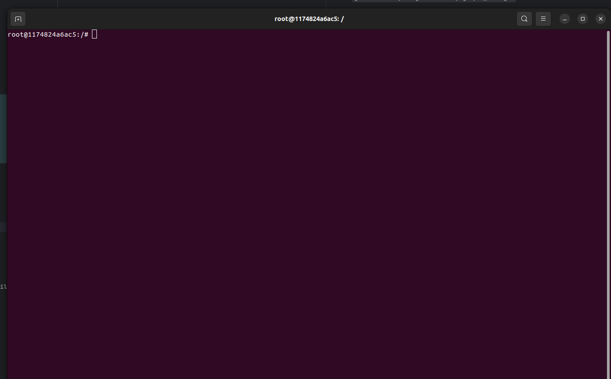

# About
This repository contains files and instruction to setting running either [OpenVINS](https://github.com/rpng/open_vins) or [OrbSlam2](https://github.com/UZ-SLAMLab/ORB_SLAM3) on your system.
## OpenVins
The primary cameras used in the lab are realsense d455 ,the calibration files in the `calibration` directory should provide a decent enough accuracy for either VIO pipelines.
Make sure docker is installed on your system , visit [here](https://docs.docker.com/engine/install/ubuntu/) for more information on how to set it up.
### Setup
Open your terminal of choice and run these sequentially.

Create a directory for odometry related projects. <span style="color:red">This step is not required</span>
- `mkdir ~/odometry && cd ~/odometry`

Clone the OpenVINS repository

- `git clone https://github.com/rpng/open_vins.git` 

Change directory and rename the ROS2 Ubuntu DockerFile

- `cd open_vins && cp Dockerfile_ros2_20_04 Dockerfile`

Build the image and name it as `openvins`

- `docker build . -t openvins`

Create a bash file named ``run_openvins_docker.sh`` by running

- `touch run_openvins_docker.sh`

Copy the commands below into this file
```shell
xhost +
export DOCKER_CATKINWS=$(pwd)
docker run  -it --runtime=nvidia  --net=host --gpus all \
    --env NVIDIA_DRIVER_CAPABILITIES=all --env DISPLAY=$DISPLAY \
    --env QT_X11_NO_MITSHM=1  --volume /tmp/.X11-unix:/tmp/.X11-unix --privileged  \
    --volume /dev:/dev \
    --mount type=bind,source=$DOCKER_CATKINWS,target=/catkin_ws/src/open_vins  $1 open_vins bash
   
```
Copy the `scripts` folder from this repo and place it in the `open_vins` directory

Next run this script

- `bash run_openvins_docker.sh`

You terminal should look like as below <br/>



Change directory to `catkin_ws` and build `open_vins` by running

- `cd catkin_ws && colcon build`

#### Debugging build failure
Normally this should build openvins but I have not had this luck.
<p style="color:green">These are unoffical steps</p>
The various packages depend on each other ,hence build and install them individually then run `colcon build`
<p style="color:red">The order is important</p>

- `cd /catkin_ws/src/open_vins/ov_init && rm -rf build && cmake --build build && make install`
- `cd /catkin_ws/src/open_vins/ov_core && rm -rf build && cmake --build build && make install`
- `cd /catkin_ws/src/open_vins/ov_eval && rm -rf build && cmake --build build && make install`
- `cd /catkin_ws/src/open_vins/ov_msckf && rm -rf build && cmake --build build && make install`
- `cd /catkin_ws && colcon build`

<p style="color:green">It should be successfully now</p>

### Running Monocular VIO

- For the rovers in the lab , use the configuration file in `configs/rs_d455`
  The parameters that have been changed from the defaults are as follows:
        - `try_zupt:true` 
        - `init_window_time: 0.5`
        - `init_imu_thresh: 1.5`
        - `max_slam: 25`

Update the file in `open_vins/config/rs_d455/estimator_config.yaml`  with the above parameters and replace with the config files provided in this repository.
<br/>
<span style="color:red">NB:</span> Run `colcon build && source /catkin_ws/install/setup.sh` after any update to config files for the changes to take effect


- I assume you are familiar with ros realsense ,if not see [here](https://github.com/IntelRealSense/realsense-ros).
Run the `run_realsense.sh` script in the `scripts` folder to run the realsense camera and map the streams to correct topics. Confirm the topic names of the camera and imu match the names in your 
`open_vins/config/rs_d455/kalibr_imucam_chain.yaml`  and `open_vins/config/rs_d455/kalibr_imu_chain.yaml` files.

- Next, copy and run this command `ros2 launch ov_msckf subscribe.launch.py config:=rs_d455 max_cameras:=1 use_stereo:=false rviz_enable:=true` or run the `run_msckf.sh` file provided in the `scripts` folder

### Running Stereo VIO
- First ,I recommend using the `run_realsense_stereo.sh` script.
- Next open a second terminal in your docker container and run `ros2 param set /camera/camera depth_module.emitter_enabled 0`
- Copy the `rs_d455_stereo` folder into `open_vins/config`  (<b>NB:</b> Remember to build)
- Next run `ros2 launch ov_msckf subscribe.launch.py config:=rs_d455_stereo rviz_enable:=true`  or run the `run_stereo_msckf.sh` file

<p style="color:green">Consider calibrating the camera for better accuracy</p>

## OrbSLAM

Soon

